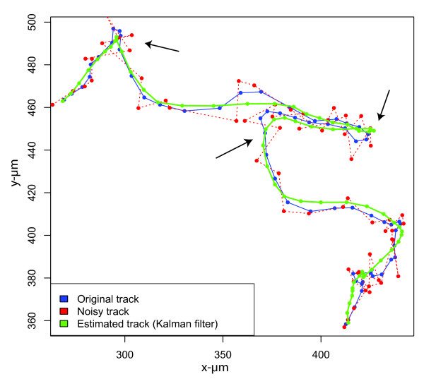

# Kalman Filters

_Optimal Estimator for Continuously Changing Systems_

  

* Discrete, Multi-modal approach to localization [ `markov_localization.ipynb` ]

* Continuous, Uni-modal approach to localization [ `kalman_filters.ipynb` ]
